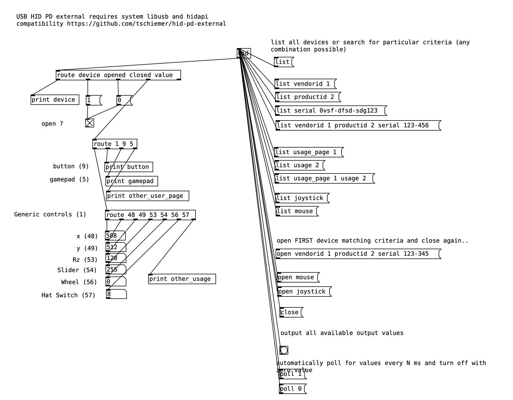

# hid-pd-external

An USB HID external for PureData (PD) 

*Note* the current version only outputs raw values as received from the HID -
HID descriptor input item specifics (such as min/max, units, exponentials, etc)
are not respected. This is not yet implemented in the underlaying [USB-HID-Report-Parser](https://github.com/tschiemer/USB-HID-Report-Parser/tree/usbhid_map).

Built and tested on macos 10.15.7.
Tested RPi 4 (5.10.17-v7l+), in principle works but is suboptimal.



## Todos

- [ ] Add output report support
- [ ] Feature reports?
- [ ] Use hidraw instead of libusb (see note under linux)

## Building

### macos

*Should* work as is..

```bash 
git clone --recursive https://github.com/tschiemer/hid-pd-external
cd hid-pd-external/
make -f Makefile.macos && make -f Makefile.macos install
```

### linux (Raspberry Pi)

A bit more troublesome.. these instructions might not get you all the way, but should be a start.

*NOTE* as it is, using libusb (in this external) on linux is somewhat invasive on USB devices as kernel
drivers might be detached for this to work. Using hidraw (as offered by hidapi) this seems to work without
further problem, but this is something that remains to be done.

Make sure to install required libraries:

```bash
sudo apt install libusb-1.0-0-dev libhidapi-dev
```

```bash
git clone --recursive https://github.com/tschiemer/hid-pd-external
cd hid-pd-external/
make -f Makefile.linux
sudo make -f Makefile.linux install
```

*NOTE* Your user will have to get direct access to HID devices, if you know which device it is, you can do something like  

```bash
sudo chmod 777 /dev/bus/usb/001/003
```

In principle you could set up [udev to do this for you](https://askubuntu.com/a/15643) (but didn't work for me).


## `hid` object interface

- `list [vendorid <vendor-id>] [productid <product-id>] [serial <serial-str>] [usage_page <usage-page>] [usage <usage>]`

Output any HID devices matching the given criteria in the form of:

`device <usage-page> <usage> <vendor-id> <product-id> <serial-str> <manufacturer-str> <product-str>`

If `serial-str`, `manufacturer-str` or `product-str` is not defined by the device will return a dash `-`.

- `open  [vendorid <vendor-id>] [productid <product-id>] [serial <serial-str>] [usage_page <usage-page>] [usage <usage>]`

Attempts to open first device matching given criteria for interaction.

Outputs `opened` message on success.

- `close`

Closes previously opened device.

- *bang* / `poll <msec>`

Output/process incoming reports and output changed values in the form of

`value <usage-page> <usage> <value>`

If polling (`<msec>` > 0) is enabled *banging* is not possible, to disable polling set `<msec>` equal zero.

## License

Copyright 2021 ICST Institute for Computer Music and Sound
Technology, Zurich University of the Arts
All rights reserved.

GNU General Public License v3

Author Philip Tschiemer, https://github.com/tschiemer

Relies on (also see [deps](deps)):
- [libusb](https://github.com/libusb/libusb)
- [hidapi](https://github.com/libusb/hidapi)
- [USB-HID-Report-Parser](https://github.com/tschiemer/USB-HID-Report-Parser/tree/usbhid_map)
- [pd-lib-builder](https://github.com/pure-data/pd-lib-builder)